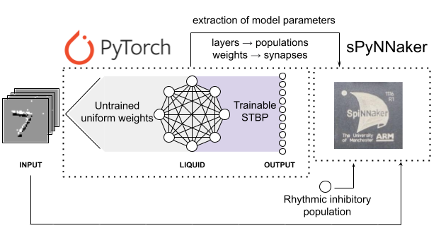

# Liquid State Machine on SpiNNaker for Spatio-Temporal Classification Tasks
 LSM trained in PyTorch and implemented on SpiNNaker for the N-MNIST Dataset
 
 
 
 
#### Usage: 
- Pytorch training (readout layer): pytorch/LSM_NMNIST.ipynb
- SpiNNaker inference: spinnaker/spinnaker_inference.ipynb

#### Prerequisites: 
- NMNIST Dataset. Downloadable [here](https://drive.google.com/drive/folders/1XkqIHMioy4fmbTgJ__x4bjN_YWs9XU4a?usp=sharing).
- pytorch
- matplotlib
- h5py
- spynnaker. Tested on SpiNN-3, SpiNN-5 and HBP Server

#### Citation
- Patiño-Saucedo, A., Rostro-González, H., Serrano-Gotarredona, T., & Linares-Barranco, B. (2022). Liquid State Machine on SpiNNaker for Spatio-Temporal Classification Tasks. Frontiers in Neuroscience, 16. [Full text](https://www.frontiersin.org/articles/10.3389/fnins.2022.819063/full)
